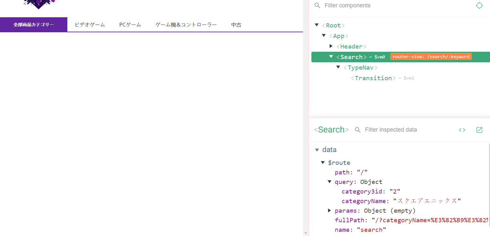
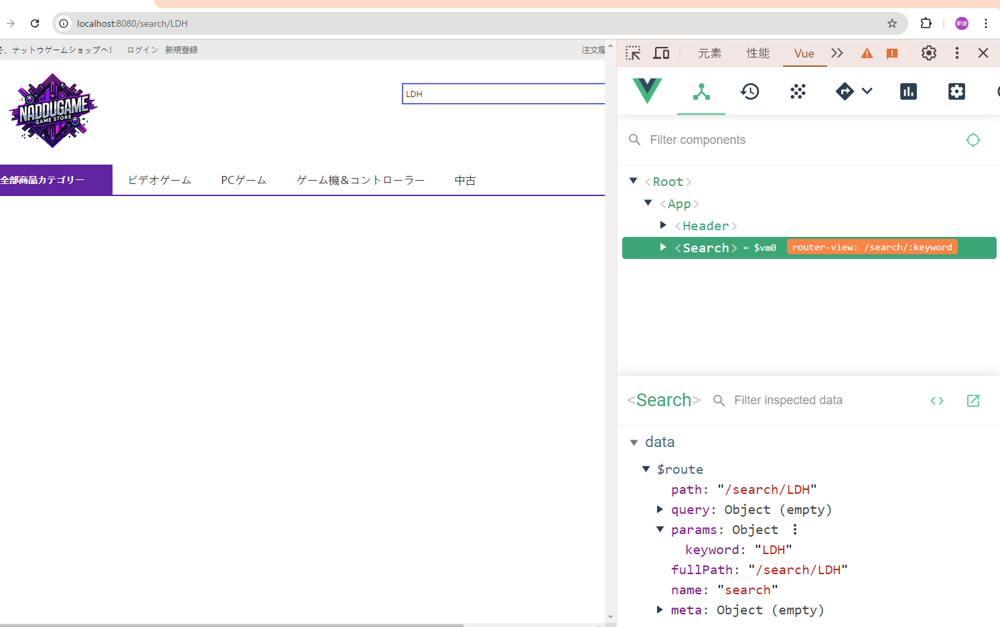
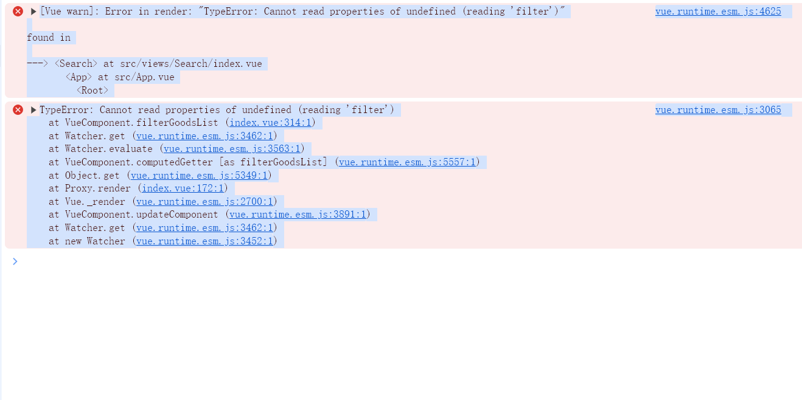

<!-- ナビゲーションからもらったデータは、queryデータだけ、paramsデータはもらえない -->

<!-- 検索からもらったデータは、paramデータだけ、queryデータはもらえない -->

<!-- その問題を解決するため、もらったデータを合併する必要がある -->

<!-- search组件的filterGoodList计算属性 goodList 未定义
计算属性在被访问前未加载
 -->
 
    filterGoodsList() {
      return Array.isArray(this.goodsList) ? this.goodsList.filter((good)=>{//这样就能确保goodsList不是空数据
        const matchesCategory = !this.searchParams.categoryName ||
        good.attributes_summary.includes(`ジャンル:${this.searchParams.categoryName}`
        ) ||
        good.attributes_summary.includes(
          `機種:${this.searchParams.categoryName}`
        ) ||
        good.attributes_summary.includes(
          `ブランド:${this.searchParams.categoryName}`
        );
        const matchesProps = this.searchParams.props.every((prop) =>{
          const[attrId,attrValue] = prop.split(":");
          return good.attributes_summary.includes(`属性${attrId}:${attrValue}`);
        });
        return matchesCategory && matchesProps;
      }):[];

    },